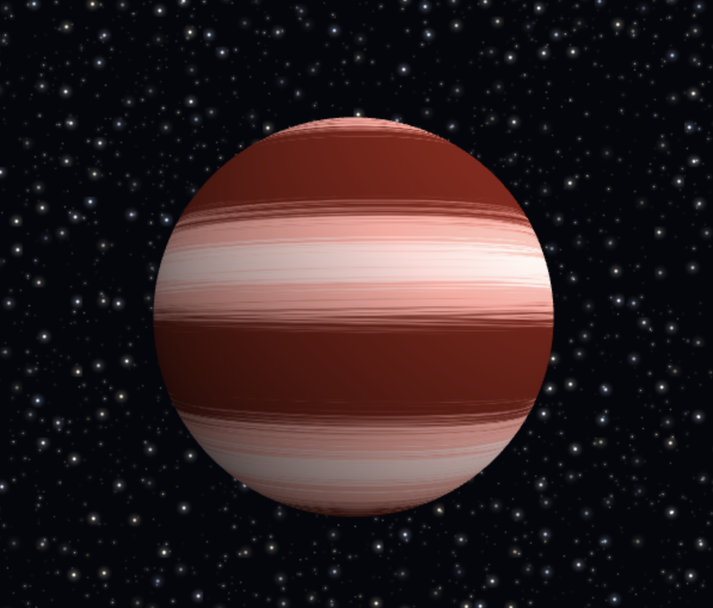
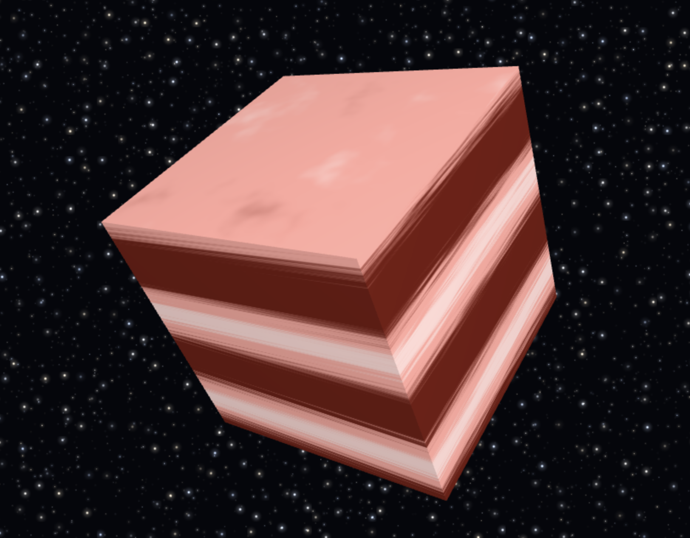
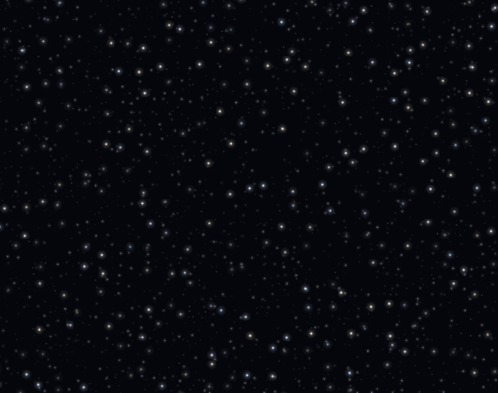
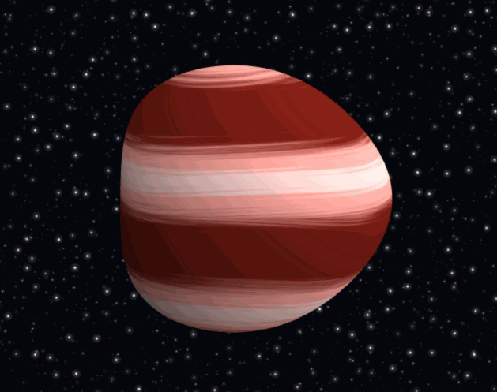
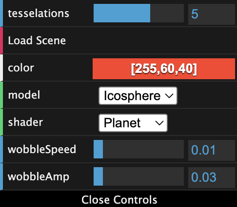
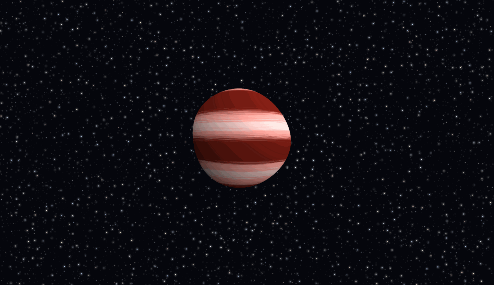

# HW 0: Intro to Javascript and WebGL

A procedural gas giant rendered in WebGL2. Everything on screen — the bands,
the starfield, the surface motion — is generated from noise in the shaders.
No textures are loaded.

**[Live Demo](https://ronan83.github.io/hw00-intro-base/)**



*an icosphere shaded by 3D Perlin noise against a procedural starfield.*

---

## Cube

`Cube` extends `Drawable` with 24 vertices and 36 indices. Each of the six
faces gets its own four vertices rather than sharing the eight corners, so
every face can carry a single flat normal. Sharing corners would force one
normal to serve three differently-oriented faces, and Lambert shading would
round the cube off.



*The same shader on the cube. The hard edge between faces is only possible because their normals are independent.*

## Custom Fragment Shader

### 3D Perlin noise

The noise follows Perlin's 2002 "Improved Noise" structure: hash each of the
eight surrounding lattice corners into a gradient vector, take the dot product
with the vector from that corner to the sample point, then blend the eight
results with trilinear interpolation. The blend weights come from the fade
curve `6t⁵ − 15t⁴ + 10t³`, whose first and second derivatives both vanish at
0 and 1 — without that, the lattice grid shows up as visible creases.

The hash is `fract(sin(dot(...)))`, so no permutation table or lookup texture
is needed.

### Bands

Latitude bands start as `sin(y * bandFreq)`. On their own these are perfectly
straight stripes. Adding an fBm field to the sine's phase bends them into the
ribbon shapes real gas giants have — the turbulence strength controls how far
they stray from straight.

Colors come from two `smoothstep` blends over the band value: a wide one
separating dark from light bands, and a narrow one picking out the brightest
ribbons. All three colors derive from `u_Color`, so the whole palette shifts
together.

### Differential rotation

The noise field drifts along x over time, but bands near the equator drift
faster than those near the poles, mirroring how Jupiter's atmosphere actually
rotates. This is a single `mix(1.0, 0.3, abs(latitude))` on the drift speed.

## Starfield Background

The background is the existing `Square` drawn through its own shader pair.
Its vertices already span [-1, 1], which is exactly clip space, so the vertex
shader writes them straight to `gl_Position` and skips every matrix. Depth
writes are disabled while it draws, so it never occludes the planet no matter
what order things are rendered in.

The stars come from cell noise rather than a texture. The plane is divided
into a grid, each cell hashed to decide whether it holds a star at all, and
the surviving stars are jittered off their cell centers so the grid never
shows. Three layers at different cell sizes give a sense of depth, and each
star carries its own sine phase so they twinkle out of step with one another.



*Three layers of cell noise. Density, scale, and brightness differ per layer.*

## Custom Vertex Shader



*`wobbleAmp` pushed high on the cube. The faces pull apart because each already has its own vertices.*

Vertices are displaced along a per-axis sine wave:

```glsl
float w = u_Time * u_WobbleSpeed;
vec3 offset = vec3(
    sin(w * 1.0  + vs_Pos.y * 3.0),
    sin(w * 1.5  + vs_Pos.z * 2.5),
    sin(w * 1.25 + vs_Pos.x * 3.5)
);
```

Two things keep this non-uniform. Each axis reads a *different* coordinate for
its spatial phase — x's offset varies with y, y's with z, z's with x — so no
two vertices at different positions move identically. And the three time
multipliers never line up into a single breathing motion, so the shape keeps
folding into new configurations instead of looping visibly.

## Controls



| Control | Effect |
| --- | --- |
| `tesselations` | Icosphere subdivision level, 0–8. Higher values give a smoother sphere and more vertices for the vertex shader to displace. Has no effect on the cube or square. |
| `Load Scene` | Rebuilds all geometry from scratch. |
| `color` | Base hue for the entire palette. The dark bands are a shaded version of it and the light bands a washed-out version, so the whole surface shifts together rather than just one layer. |
| `model` | Switch between Icosphere, Cube, and Square. |
| `shader` | Switch between the custom Planet shader and the original Lambert shader, for comparison. |
| `wobbleSpeed` | How fast the vertex displacement cycles. Scales time only, so the sequence of shapes stays the same — just stretched or compressed. |
| `wobbleAmp` | How far vertices are pushed. At 0 the geometry is untouched, which is useful for judging the fragment shader on its own. Past ~0.1 on the cube the faces separate enough to see that each carries its own normal. |

## Full Scene



*Everything together: the planet, the starfield behind it, and the control panel. Every pixel here comes from noise evaluated in a shader.*
